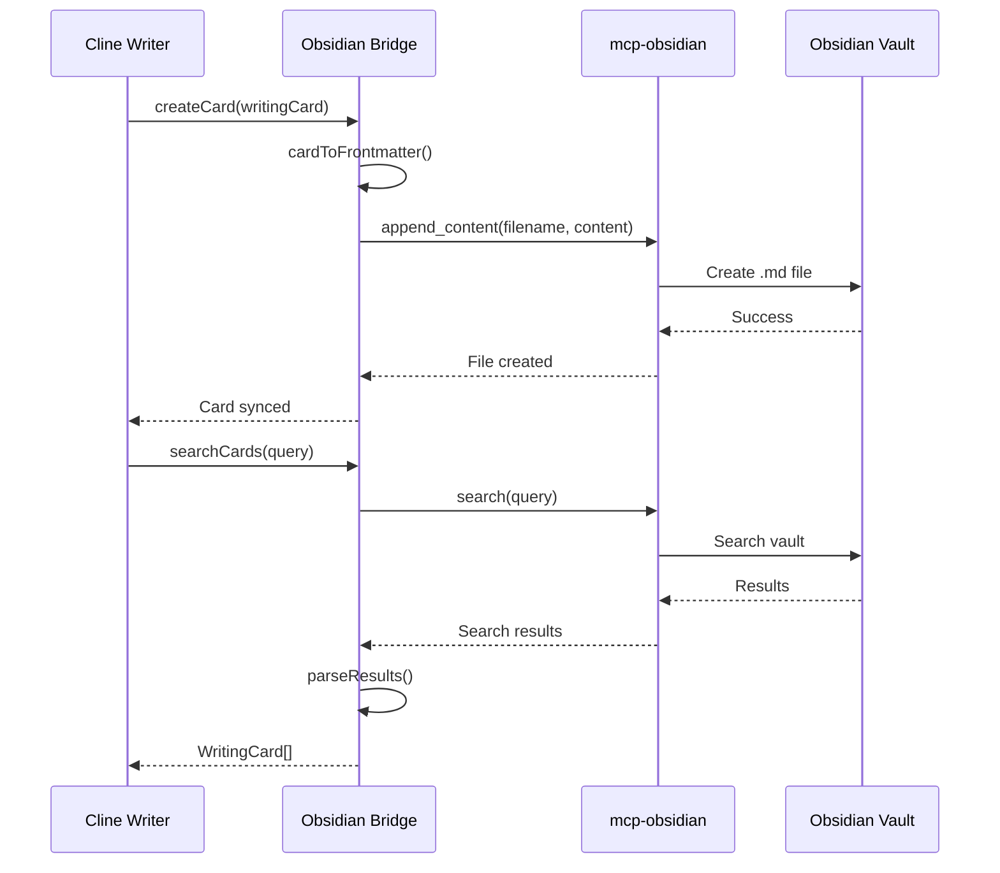

# Obsidian MCP Server Integration Plan

## Overview
Integrate Cline for Writers with Obsidian vaults using the existing mcp-obsidian server implementation, enabling seamless bi-directional synchronization and collaborative writing workflows.

**Status Update**: An existing MCP server for Obsidian (mcp-obsidian by MarkusPfundstein) provides the foundation for this integration. We can build a WritingCard bridge on top of this server rather than creating a new one.

## Phase 1: WritingCard Bridge Implementation

### Core Bridge Components

1. **WritingCard Mapping**
   - Map WritingCard.id to Obsidian note filenames
   - Store WritingCard metadata in frontmatter
   - Preserve WritingCard content as note body
   - Sync position data for corkboard layout

2. **MCP Server Configuration**
   - Use existing mcp-obsidian server
   - Configure with Obsidian REST API plugin
   - Set up auto-approval for read operations
   - Handle authentication and connection

3. **Bidirectional Sync Service**
   - Real-time sync between Cline and Obsidian
   - Conflict resolution with timestamps
   - Batch operations for performance
   - Incremental updates only

4. **Memory Bank Integration**
   - Sync memory_bank folder to Obsidian
   - Maintain project context across platforms
   - Handle structured templates and research notes

5. **Error Handling & Recovery**
   - Robust connection management
   - Graceful fallback when Obsidian unavailable
   - Data integrity checks and validation

### Using Existing MCP Tools

The mcp-obsidian server provides these tools that we'll use in our bridge:

1. **list_files_in_vault** - Discover all writing cards
2. **get_file_contents** - Read individual WritingCard data  
3. **search** - Find cards by content or metadata
4. **append_content** - Create new WritingCards
5. **patch_content** - Update existing cards
6. **delete_file** - Remove cards when needed

### WritingCard Data Mapping

```yaml
---
title: "Scene 1: The Discovery"
card_id: "card-scene-1-discovery" 
status: "draft"
tags: ["scene", "chapter1", "mystery"]
chunk_id: "chapter-1-opening"
position: 
  x: 100
  y: 150  
  width: 300
  height: 200
word_count: 245
created_at: "2025-01-07T10:30:00Z"
updated_at: "2025-01-07T15:45:00Z"  
priority: 1
color: "#ffeb3b"
---

The old journal felt heavy in Emma's hands as she discovered it hidden behind the loose floorboard. Its leather cover was worn smooth by countless hands, and mysterious symbols were etched along its edges.

She opened it carefully, afraid the aged pages might crumble at her touch...
```

## Phase 2: Enhanced Writing Features

### Advanced Integration

1. **Canvas Integration**
   - Map WritingCard positions to Obsidian Canvas
   - Visual project structure and story mapping
   - Drag-and-drop card arrangement
   - Connection lines between related cards

2. **Plugin Ecosystem Access**
   - Templater integration for card templates
   - Dataview queries for card analytics  
   - Citations plugin for research management
   - Daily notes for writing session tracking

3. **Graph Analysis**
   - Visualize connections between cards
   - Identify orphaned content
   - Suggest related writing pieces
   - Track narrative flow

### Content Enhancement Tools

1. **Smart Linking**
   - Auto-link character mentions to profiles
   - Connect scenes to location notes
   - Link research to relevant cards
   - Maintain consistency across project

2. **Writing Analytics**
   - Word count trends over time
   - Writing velocity by card/chunk
   - Progress tracking toward goals
   - Session productivity metrics

3. **Research Integration**
   - Link external sources to cards
   - Citation management workflow
   - Research note organization
   - Source verification tracking

## Phase 3: Collaboration Features

### Advanced Integration

1. **vault_backup**
   - Create snapshots before major edits
   - Version control integration
   - Checkpoint restoration

2. **collaborative_editing**
   - Multi-user awareness
   - Change tracking
   - Comment system integration

3. **export_pipeline**
   - Convert between formats
   - Academic citation management
   - Publishing workflows

## Implementation Architecture

### Bridge Service Structure
```
src/integrations/obsidian/
├── ObsidianIntegration.ts        # Main integration controller
├── ObsidianWritingCardBridge.ts  # WritingCard ↔ Obsidian mapping  
├── ObsidianMemoryBankSync.ts     # Memory bank synchronization
├── ObsidianCanvasManager.ts      # Canvas integration for visual layout
├── ObsidianSearchService.ts      # Enhanced search capabilities
└── types/
    ├── ObsidianNote.ts          # Note structure definitions
    └── SyncStatus.ts            # Synchronization state types
```

### Configuration Example
```json
{
  "mcpServers": {
    "obsidian-writer": {
      "command": "uvx",
      "args": ["mcp-obsidian"],
      "env": {
        "OBSIDIAN_API_KEY": "your-api-key-here",
        "OBSIDIAN_HOST": "127.0.0.1", 
        "OBSIDIAN_PORT": "27124"
      },
      "disabled": false,
      "autoApprove": [
        "list_files_in_vault",
        "get_file_contents", 
        "search"
      ]
    }
  }
}
```

### WritingCard Bridge Flow


## Integration Benefits

### For Cline Users
- Access vast Obsidian plugin ecosystem
- Leverage existing note-taking workflows
- Visual project mapping via Canvas
- Powerful search and linking

### For Obsidian Users
- AI-powered writing assistance
- Automated research organization
- Citation management
- Multi-format export

### Shared Benefits
- Seamless memory_bank synchronization
- Cross-platform compatibility
- Non-invasive integration
- Gradual adoption pathway

## Development Timeline

### Week 1-2: Bridge Implementation  
- Implement ObsidianWritingCardBridge core functionality
- WritingCard ↔ Obsidian note mapping
- Basic CRUD operations via mcp-obsidian tools
- Configuration and connection management

### Week 3-4: Memory Bank Sync
- ObsidianMemoryBankSync implementation  
- Bidirectional memory bank synchronization
- Project structure creation in Obsidian
- Template integration and management

### Week 5-6: Advanced Features
- Canvas integration for visual card layout
- Search and discovery enhancements
- Plugin ecosystem integration (Templater, Dataview)
- Error handling and conflict resolution

### Week 7-8: Polish & Testing
- Performance optimization for large projects
- Comprehensive error handling
- User documentation and tutorials
- Real-world testing with various vault configurations

## Success Metrics

1. **Technical Metrics**
   - < 100ms response time for WritingCard operations
   - 99%+ data integrity in bidirectional sync
   - Support for projects with 1,000+ cards
   - Reliable connection to Obsidian via mcp-obsidian server

2. **User Experience Metrics**  
   - Seamless context switching between Cline and Obsidian
   - Zero data loss during sync operations
   - Intuitive card creation/editing in both environments
   - Natural integration with existing Obsidian workflows

3. **Integration Metrics**
   - Full WritingCard feature parity in Obsidian  
   - Memory bank sync maintains project context
   - Canvas integration preserves visual layout
   - Plugin ecosystem enhances writing workflow

## Risk Mitigation

### Technical Risks
- **File System Race Conditions**: Implement file locking
- **Large Vault Performance**: Lazy loading and caching
- **Plugin Compatibility**: Version compatibility matrix

### User Experience Risks
- **Learning Curve**: Comprehensive tutorials and examples
- **Workflow Disruption**: Optional features with gradual rollout
- **Data Loss**: Backup mechanisms and conflict resolution
