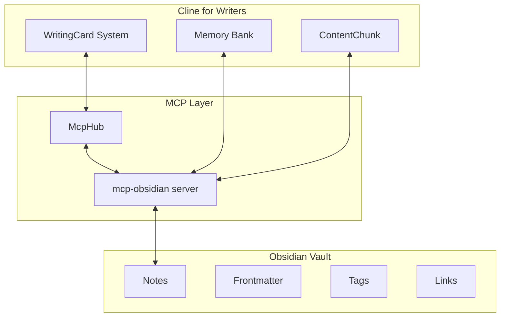

# Obsidian WritingCard Bridge Implementation

## Overview

This document provides a complete template for integrating Cline for Writers' WritingCard system with Obsidian vaults using the existing mcp-obsidian server implementation.

## Architecture



## WritingCard to Obsidian Mapping

### 1. Core Data Mapping

| WritingCard Field | Obsidian Equivalent | Implementation |
|-------------------|---------------------|----------------|
| `id` | Note filename | `{id}.md` |
| `title` | Frontmatter `title` | YAML header |
| `content` | Note body | Markdown content |
| `tags` | Obsidian tags | `#tag` or frontmatter |
| `status` | Frontmatter `status` | YAML field |
| `position` | Frontmatter `position` | JSON object |
| `metadata.chunkId` | Frontmatter `chunk` | Reference |
| `metadata.wordCount` | Auto-calculated | Plugin/script |
| `metadata.createdAt` | File created date | System |
| `metadata.updatedAt` | File modified date | System |

### 2. Frontmatter Template

```yaml
---
title: "Card Title"
card_id: "unique-card-id-12345"
status: "draft"
tags: ["scene", "chapter1"]
chunk_id: "chunk-abc-123"
position:
  x: 100
  y: 200
  width: 300
  height: 200
word_count: 250
created_at: "2025-01-07T10:30:00Z"
updated_at: "2025-01-07T15:45:00Z"
priority: 1
color: "#ffeb3b"
---

# Card Content

This is the main content of the writing card. It can contain:
- Multiple paragraphs
- **Bold text**
- *Italic text*
- [[Internal Links]]
- > Quotes

## Subsections

Additional structured content...
```

## Implementation Components

### 1. MCP Server Configuration

Add to `cline_mcp_settings.json`:

```json
{
  "mcpServers": {
    "obsidian-writer": {
      "command": "uvx",
      "args": ["mcp-obsidian"],
      "env": {
        "OBSIDIAN_API_KEY": "your-api-key-here",
        "OBSIDIAN_HOST": "127.0.0.1",
        "OBSIDIAN_PORT": "27124"
      },
      "disabled": false,
      "autoApprove": [
        "list_files_in_vault",
        "get_file_contents",
        "search"
      ]
    }
  }
}
```

### 2. WritingCard Bridge Service

```typescript
// src/services/obsidian/ObsidianWritingCardBridge.ts

export interface ObsidianWritingCardBridge {
  // Core CRUD operations
  createCard(card: WritingCard): Promise<void>
  readCard(cardId: string): Promise<WritingCard | null>
  updateCard(card: WritingCard): Promise<void>
  deleteCard(cardId: string): Promise<void>
  
  // Bulk operations
  syncAllCards(): Promise<WritingCard[]>
  syncMemoryBank(): Promise<void>
  
  // Search and discovery
  searchCards(query: string): Promise<WritingCard[]>
  getCardsByChunk(chunkId: string): Promise<WritingCard[]>
  getCardsByStatus(status: CardStatus): Promise<WritingCard[]>
  
  // Content management
  appendToCard(cardId: string, content: string): Promise<void>
  patchCardContent(cardId: string, patch: ContentPatch): Promise<void>
}

interface ContentPatch {
  heading?: string
  blockReference?: string
  content: string
  operation: 'insert' | 'replace' | 'append'
}

export class ObsidianBridge implements ObsidianWritingCardBridge {
  constructor(private mcpHub: McpHub) {}
  
  async createCard(card: WritingCard): Promise<void> {
    const filename = `${card.id}.md`
    const frontmatter = this.cardToFrontmatter(card)
    const content = this.formatCardContent(frontmatter, card.content)
    
    await this.mcpHub.useToolSafe("obsidian-writer", "append_content", {
      file_path: filename,
      content: content
    })
  }
  
  async readCard(cardId: string): Promise<WritingCard | null> {
    const filename = `${cardId}.md`
    
    try {
      const result = await this.mcpHub.useToolSafe("obsidian-writer", "get_file_contents", {
        file_path: filename
      })
      
      return this.parseObsidianNote(result.content)
    } catch (error) {
      if (error.message.includes('not found')) {
        return null
      }
      throw error
    }
  }
  
  async updateCard(card: WritingCard): Promise<void> {
    const filename = `${card.id}.md`
    const frontmatter = this.cardToFrontmatter(card)
    const content = this.formatCardContent(frontmatter, card.content)
    
    // Use patch_content to update the entire file
    await this.mcpHub.useToolSafe("obsidian-writer", "patch_content", {
      file_path: filename,
      content: content,
      heading: "", // Replace entire file
    })
  }
  
  async syncAllCards(): Promise<WritingCard[]> {
    // Get all .md files from vault
    const files = await this.mcpHub.useToolSafe("obsidian-writer", "list_files_in_vault", {})
    
    const cardFiles = files.files.filter(f => 
      f.name.endsWith('.md') && 
      f.name.match(/^[a-zA-Z0-9-]+\.md$/) // Match card ID pattern
    )
    
    const cards: WritingCard[] = []
    
    for (const file of cardFiles) {
      const content = await this.mcpHub.useToolSafe("obsidian-writer", "get_file_contents", {
        file_path: file.name
      })
      
      const card = this.parseObsidianNote(content.content)
      if (card) {
        cards.push(card)
      }
    }
    
    return cards
  }
  
  async searchCards(query: string): Promise<WritingCard[]> {
    const searchResults = await this.mcpHub.useToolSafe("obsidian-writer", "search", {
      query: query
    })
    
    const cards: WritingCard[] = []
    
    for (const result of searchResults.results) {
      if (result.filename.endsWith('.md')) {
        const card = await this.readCard(this.extractCardId(result.filename))
        if (card) {
          cards.push(card)
        }
      }
    }
    
    return cards
  }
  
  private cardToFrontmatter(card: WritingCard): Record<string, any> {
    return {
      title: card.title,
      card_id: card.id,
      status: card.status,
      tags: card.tags,
      chunk_id: card.metadata.chunkId,
      position: card.position,
      word_count: card.metadata.wordCount,
      created_at: card.metadata.createdAt.toISOString(),
      updated_at: card.metadata.updatedAt.toISOString(),
      priority: card.metadata.priority,
      color: card.metadata.color
    }
  }
  
  private formatCardContent(frontmatter: Record<string, any>, content: string): string {
    const yamlHeader = '---\n' + 
      Object.entries(frontmatter)
        .map(([key, value]) => `${key}: ${JSON.stringify(value)}`)
        .join('\n') + 
      '\n---\n\n'
    
    return yamlHeader + content
  }
  
  private parseObsidianNote(noteContent: string): WritingCard | null {
    const frontmatterMatch = noteContent.match(/^---\n([\s\S]*?)\n---\n\n?([\s\S]*)$/)
    
    if (!frontmatterMatch) {
      return null // Not a valid card note
    }
    
    const [, frontmatterText, content] = frontmatterMatch
    const frontmatter = this.parseFrontmatter(frontmatterText)
    
    if (!frontmatter.card_id) {
      return null // Not a card note
    }
    
    return {
      id: frontmatter.card_id,
      title: frontmatter.title || 'Untitled',
      content: content.trim(),
      tags: frontmatter.tags || [],
      status: frontmatter.status || 'draft',
      history: [], // Would need to implement version tracking
      position: frontmatter.position || { x: 0, y: 0, width: 300, height: 200 },
      metadata: {
        wordCount: frontmatter.word_count || this.countWords(content),
        createdAt: new Date(frontmatter.created_at),
        updatedAt: new Date(frontmatter.updated_at),
        chunkId: frontmatter.chunk_id,
        color: frontmatter.color,
        priority: frontmatter.priority
      }
    }
  }
  
  private parseFrontmatter(text: string): Record<string, any> {
    // Simple YAML parser - in production, use a proper YAML library
    const result: Record<string, any> = {}
    
    text.split('\n').forEach(line => {
      const match = line.match(/^(\w+):\s*(.+)$/)
      if (match) {
        const [, key, value] = match
        try {
          result[key] = JSON.parse(value)
        } catch {
          result[key] = value.replace(/^["']|["']$/g, '') // Remove quotes
        }
      }
    })
    
    return result
  }
  
  private countWords(text: string): number {
    return text.split(/\s+/).filter(word => word.length > 0).length
  }
  
  private extractCardId(filename: string): string {
    return filename.replace(/\.md$/, '')
  }
}
```

### 3. Memory Bank Integration

```typescript
// src/services/obsidian/ObsidianMemoryBankSync.ts

export class ObsidianMemoryBankSync {
  constructor(
    private bridge: ObsidianWritingCardBridge,
    private mcpHub: McpHub
  ) {}
  
  async syncMemoryBankToObsidian(): Promise<void> {
    const memoryBankPath = path.join(vscode.workspace.rootPath!, 'memory_bank')
    
    // Sync core memory bank files
    const coreFiles = [
      'project_state.md',
      'style_guide.md',
      'research_template.md'
    ]
    
    for (const file of coreFiles) {
      const localPath = path.join(memoryBankPath, file)
      
      if (await fs.pathExists(localPath)) {
        const content = await fs.readFile(localPath, 'utf-8')
        const obsidianPath = `memory_bank/${file}`
        
        await this.mcpHub.useToolSafe("obsidian-writer", "append_content", {
          file_path: obsidianPath,
          content: content
        })
      }
    }
    
    // Sync folders (characters, outlines, research, etc.)
    const folders = ['characters', 'outlines', 'research', 'drafts', 'citations']
    
    for (const folder of folders) {
      await this.syncFolder(path.join(memoryBankPath, folder), `memory_bank/${folder}`)
    }
  }
  
  async syncObsidianToMemoryBank(): Promise<void> {
    // Pull changes from Obsidian back to local memory bank
    const memoryBankFiles = await this.mcpHub.useToolSafe("obsidian-writer", "list_files_in_dir", {
      dir_path: "memory_bank"
    })
    
    for (const file of memoryBankFiles.files) {
      if (file.name.endsWith('.md')) {
        const content = await this.mcpHub.useToolSafe("obsidian-writer", "get_file_contents", {
          file_path: `memory_bank/${file.name}`
        })
        
        const localPath = path.join(vscode.workspace.rootPath!, 'memory_bank', file.name)
        await fs.writeFile(localPath, content.content)
      }
    }
  }
  
  private async syncFolder(localPath: string, obsidianPath: string): Promise<void> {
    if (!(await fs.pathExists(localPath))) return
    
    const files = await fs.readdir(localPath)
    
    for (const file of files) {
      if (file.endsWith('.md')) {
        const content = await fs.readFile(path.join(localPath, file), 'utf-8')
        
        await this.mcpHub.useToolSafe("obsidian-writer", "append_content", {
          file_path: `${obsidianPath}/${file}`,
          content: content
        })
      }
    }
  }
}
```

### 4. Integration with Existing Cline Systems

```typescript
// src/integrations/obsidian/ObsidianIntegration.ts

export class ObsidianIntegration {
  private bridge: ObsidianWritingCardBridge
  private memorySync: ObsidianMemoryBankSync
  
  constructor(private mcpHub: McpHub) {
    this.bridge = new ObsidianBridge(mcpHub)
    this.memorySync = new ObsidianMemoryBankSync(this.bridge, mcpHub)
  }
  
  async initializeProject(): Promise<void> {
    // Check if Obsidian MCP server is connected
    const obsidianServer = this.mcpHub.getServers().find(s => s.name === 'obsidian-writer')
    
    if (!obsidianServer || obsidianServer.status !== 'connected') {
      throw new Error('Obsidian MCP server not connected. Please configure the mcp-obsidian server.')
    }
    
    // Create project structure in Obsidian
    await this.createProjectStructure()
    
    // Initial memory bank sync
    await this.memorySync.syncMemoryBankToObsidian()
  }
  
  async createProjectStructure(): Promise<void> {
    const folders = [
      'cards',
      'chunks', 
      'memory_bank',
      'memory_bank/characters',
      'memory_bank/outlines',
      'memory_bank/research',
      'memory_bank/drafts',
      'memory_bank/citations'
    ]
    
    for (const folder of folders) {
      // Create folder by adding a .gitkeep file
      await this.mcpHub.useToolSafe("obsidian-writer", "append_content", {
        file_path: `${folder}/.gitkeep`,
        content: "# This folder is part of Cline for Writers project structure"
      })
    }
  }
  
  // Integration with existing WritingCard operations
  async saveCard(card: WritingCard): Promise<void> {
    await this.bridge.createCard(card)
  }
  
  async loadCard(cardId: string): Promise<WritingCard | null> {
    return await this.bridge.readCard(cardId)
  }
  
  async searchContent(query: string): Promise<WritingCard[]> {
    return await this.bridge.searchCards(query)
  }
  
  async syncProject(): Promise<void> {
    // Bi-directional sync
    await this.memorySync.syncMemoryBankToObsidian()
    await this.memorySync.syncObsidianToMemoryBank()
    
    // Sync all cards
    const cards = await this.bridge.syncAllCards()
    
    // Update local state (would integrate with existing state management)
    // this.updateLocalCards(cards)
  }
}
```

### 5. Usage Examples

```typescript
// Example usage in Cline for Writers

const obsidianIntegration = new ObsidianIntegration(mcpHub)

// Initialize project
await obsidianIntegration.initializeProject()

// Create a new writing card
const newCard: WritingCard = {
  id: 'card-scene-1-intro',
  title: 'Scene 1: Introduction',
  content: 'The rain drummed against the window as Sarah opened her laptop...',
  tags: ['scene', 'chapter1', 'protagonist'],
  status: 'draft',
  history: [],
  position: { x: 100, y: 100, width: 300, height: 200 },
  metadata: {
    wordCount: 45,
    createdAt: new Date(),
    updatedAt: new Date(),
    chunkId: 'chapter-1',
    color: '#ffeb3b',
    priority: 1
  }
}

await obsidianIntegration.saveCard(newCard)

// Search for cards
const searchResults = await obsidianIntegration.searchContent('protagonist')

// Sync project
await obsidianIntegration.syncProject()
```

## Benefits of this Integration

1. **Bidirectional Sync**: Changes in either Cline or Obsidian are reflected in both
2. **Rich Linking**: Leverage Obsidian's powerful linking and graph features
3. **Plugin Ecosystem**: Access to hundreds of Obsidian plugins
4. **Visual Organization**: Use Obsidian Canvas for visual project mapping
5. **Mobile Access**: Edit writing cards on mobile via Obsidian mobile app
6. **Backup & Sync**: Leverage Obsidian's sync solutions

## Implementation Notes

1. **Unique IDs**: Writing card IDs must be filesystem-safe (no special characters)
2. **Conflict Resolution**: Implement timestamp-based conflict resolution
3. **Performance**: Consider caching for large vaults
4. **Error Handling**: Robust error handling for network/API failures
5. **Incremental Sync**: Only sync changed files for better performance

## Next Steps

1. Implement the bridge service
2. Add error handling and conflict resolution
3. Create UI components for Obsidian sync status
4. Add configuration options for sync behavior
5. Test with various vault sizes and structures
